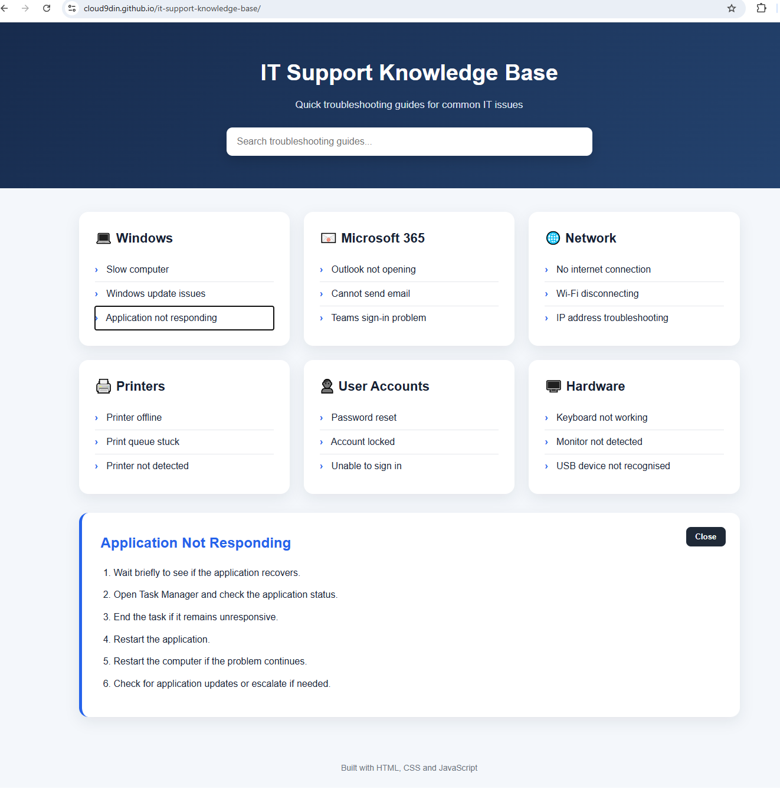

# IT Support Knowledge Base

An interactive IT support knowledge base with step-by-step troubleshooting guides for common Windows, Microsoft 365, networking, printer, account and hardware issues.

## Live Demo

https://cloud9din.github.io/it-support-knowledge-base/

## Screenshot

## Features

- 18 troubleshooting guides
- Search and filtering
- Interactive step-by-step support instructions
- Windows troubleshooting
- Microsoft 365 support
- Network troubleshooting
- Printer support
- User account support
- Hardware troubleshooting
- Responsive layout

## Technologies Used

- HTML5
- CSS3
- JavaScript
- DOM Manipulation
- Git
- GitHub Pages

## What I Learned

This project helped me practise:

- Building an interactive support interface
- JavaScript event handling
- DOM manipulation
- Search and filtering
- Writing clear troubleshooting documentation
- Responsive web design
- GitHub Pages deployment
